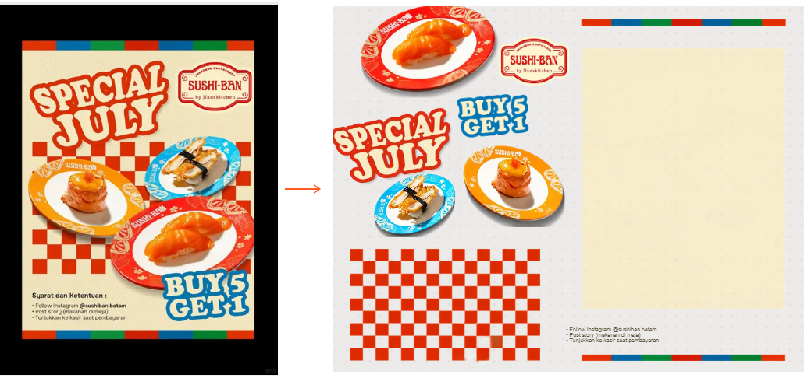
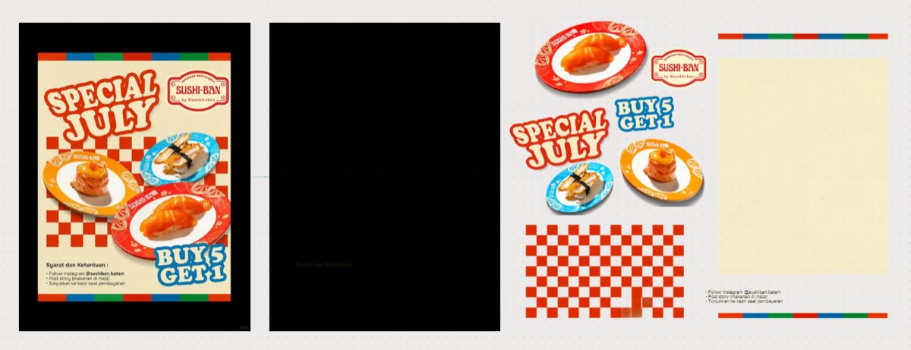
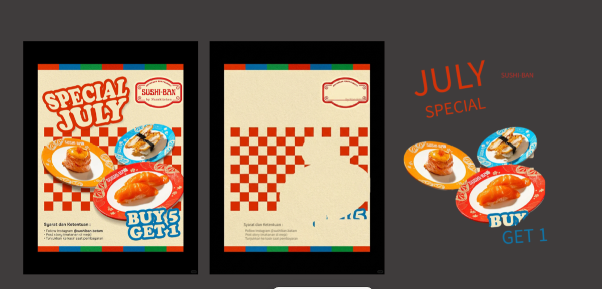
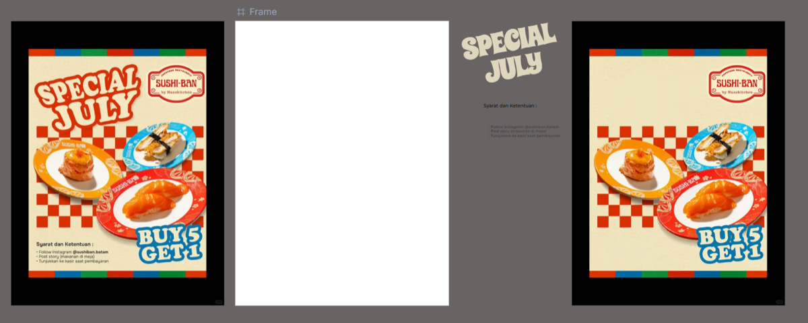
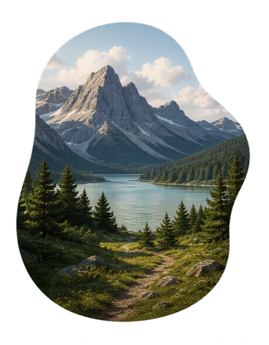

<div align="center">
  

  # Aixio Layer v1

  **The most capable image-to-layer model we have tested to date.**

  **94% layer-decomposition accuracy** across 10,000 real designs and 36 categories. Layer v1 reconstructs the background, separates visual elements, and recovers text as selectable, editable type—so a finished image can become a file you can keep designing.

  [Try in Aixio Studio](https://aixio.app/studio) · [Watch the demo](https://youtu.be/BkdkW2nn3b0) · [Read the comparison](https://aixio.app/blog/aixio-layer-v1-vs-lovart-picell-image-to-layers/) · [Model card](docs/MODEL_CARD.md) · [Evaluation](docs/EVALUATION.md)
</div>

---



## Introduction

Most finished visual work arrives as pixels: a PNG, JPEG, screenshot, export, or AI-generated image. The composition may look complete, but its structure is gone. Copy cannot be rewritten, objects cannot be moved cleanly, and removing an element reveals no usable background underneath.

Aixio Layer v1 is an image-to-layer model built to recover that structure. Given one flat raster image, it returns an ordered set of working parts:

- visual elements with transparent backgrounds;
- editable text with recovered type styling;
- a reconstructed background behind foreground objects; and
- composition structure that can be adjusted in Aixio Studio.

This is more than object extraction. Layer v1 is designed to understand what belongs together, how elements overlap, and what the hidden parts of the design should contain.

## The most capable model we have tested

On Aixio's internal image-to-layer benchmark, **Layer v1 achieves 94% decomposition accuracy**, compared with **68% for the nearest tested product, Canva Magic Layers (tested May 2026)**.

| Model | Decomposition accuracy | Result |
| --- | ---: | --- |
| **Aixio Layer v1** | **94%** | ███████████████████░ |
| Canva Magic Layers — tested May 2026 | 68% | ██████████████░░░░░░ |

This is the strongest result among the image-to-layer systems Aixio has tested. It is an **Aixio-reported benchmark**, not yet an independently reproduced leaderboard. We will update this page as the evaluation set and additional results are released.

### How the benchmark works

The test starts from real layered design files, not hand-drawn masks or model-generated labels:

1. **Ground truth:** collect real PSD and Figma files whose original layer structure is already known.
2. **Model input:** flatten each design into a single raster image—the same kind of file a user would upload.
3. **Prediction:** ask each system to recover the layers from that flat image.
4. **Matching:** pair predicted layers with the corresponding ground-truth layers.
5. **Scoring:** calculate mean intersection over union between predicted and ground-truth alpha.

The current benchmark covers **10,000 images across 36 design categories**, with the same inputs and scoring procedure used for every tested system. Alpha IoU measures decomposition accuracy; typography, layer logic, and reconstruction quality are also inspected separately because a clean mask alone does not make a design editable. Read the full [evaluation methodology and disclosure notes](docs/EVALUATION.md).

## Side-by-side comparison

The same dense retail poster was processed by Aixio Layer v1, Lovart, and Picell. It contains display typography, multiple food images, a checkerboard pattern, fine print, an offer badge, and a bordered paper field.

The honest test is not simply whether a tool cuts out visible objects. It is whether the design still works after those objects are moved: **Was the hidden background reconstructed? Did the text come back as usable type? Did the composition remain intact?**

<table>
  <tr>
    <th>Aixio Layer v1</th>
    <th>Lovart — supplied run</th>
    <th>Picell — supplied run</th>
  </tr>
  <tr>
    <td></td>
    <td></td>
    <td></td>
  </tr>
  <tr>
    <td>Meaningful elements, typography, and background structure are recovered.</td>
    <td>Some elements are found, but parts of the background and display typography require rework.</td>
    <td>Several visible pieces are extracted, but the composition is fragmented and the background is not reconstructed.</td>
  </tr>
</table>

| What we inspected | Aixio Layer v1 | Lovart — supplied run | Picell — supplied run |
| --- | --- | --- | --- |
| Meaningful element recognition | Complete poster structure recovered | Several elements remain fused | More elements found, but the offer is fragmented |
| Background reconstruction | Poster surface, border, pattern, and paper field preserved | Returned frame is blank rather than reconstructed | Removed content leaves holes and remnants |
| Typography | Copy returns as editable type with styling | Headline and small copy recognized, but design elements remain fused | Text is fragmented and requires rebuilding |
| Continued editability | Elements can be moved while the composition remains usable | Significant manual reconstruction required | Composition requires rebuilding |

These observations describe the supplied runs shown here, not every possible output from each product. Results vary with product version, source resolution, and design complexity. See the [full comparison article](https://aixio.app/blog/aixio-layer-v1-vs-lovart-picell-image-to-layers/) and [evaluation notes](docs/EVALUATION.md) for context.

## What Layer v1 does better

### 1. It recognizes the complete design

Layer v1 recovers meaningful design units rather than returning a loose collection of crops. In the poster above, it identifies the headline, offer badge, logo, three food groups, terms, checkerboard, border, and paper field.

### 2. It reconstructs what was hidden

Removing an object is only useful if the space behind it is restored. Layer v1 performs amodal completion: it predicts the hidden continuation of backgrounds and objects so elements can be moved, resized, or removed without leaving obvious holes.

### 3. It returns text as type

Recognizing words is not enough. Layer v1 returns copy as editable strings and recovers typography attributes such as font family, weight, size, color, alignment, and placement when available. Designers can rewrite and localize the copy instead of rebuilding it from pixels.

<p align="center">
  
</p>

### 4. It preserves clean, usable alpha

Visual elements return as RGBA layers with transparent backgrounds, practical boundaries, and a usable stacking order—not only as approximate masks.

<p align="center">
  
</p>

### 5. It preserves composition logic

Layer v1 reasons about grouping, layer order, orientation, and perspective. The result retains the visual hierarchy of the source instead of scattering extracted pieces across a new layout.

### 6. It preserves useful detail

Native upsampling rebuilds useful texture and edge detail during decomposition. Extracted assets remain practical for continued design work instead of becoming softer than the source.

## See it in action

<div align="center">
  <a href="https://youtu.be/BkdkW2nn3b0">
    
  </a>
  <br>
  <sub>Introducing Aixio Layer v1.0 — click to watch on YouTube</sub>
</div>

## Quick start

Layer v1 is available inside [Aixio Studio](https://aixio.app/studio).

1. Open Aixio Studio and add a finished image.
2. Choose **Edit Layers**.
3. Let Layer v1 identify the background, visual assets, text, and composition structure.
4. Select any returned layer to rewrite copy, restyle type, move objects, or continue building on the canvas.
5. Export the result for handoff when the composition is ready.

No source design file, original layer data, or embedded metadata is required.

## News

- **2026-08-04** — Aixio published the Layer v1 comparison across recognition, spatial reconstruction, font fidelity, and native upsampling.
- **2026** — Aixio Layer v1 became available in Aixio Studio.

## Designed for real creative work

Layer v1 is useful when the source file is missing or never existed:

- revise copy in a flattened campaign asset;
- localize a poster or social graphic;
- move or remove a product, badge, or subject;
- recover reusable elements from a screenshot or export;
- convert AI-generated artwork into a composition with editable structure; or
- prepare an existing visual for continued work in Studio.

## Model overview

| Property | Layer v1 |
| --- | --- |
| Task | Flat image to editable design layers |
| Input | One raster image |
| Model | 52B-parameter dense model, trained in-house for image-to-layer reconstruction |
| Visual output | Ordered RGBA elements and reconstructed background |
| Text output | Editable strings with recovered typography attributes |
| Access | Aixio Studio |

For intended use, evaluation methodology, limitations, and release details, read the [model card](docs/MODEL_CARD.md).

## Current release scope

This repository is a product and model reference. It does not currently contain downloadable model weights, training code, or a local inference package. Layer v1 can be used through Aixio Studio; public programmatic access should be described here only when an official API is released.

## Limitations

- Results vary with source resolution, compression, visual density, and design complexity.
- Highly stylized, distorted, or partially obscured text may require manual correction.
- A recovered font may need substitution if the original family is unavailable or unlicensed in the working environment.
- Fine transparency, motion blur, reflections, and tightly fused elements can require review.
- Reconstructed regions are model predictions and should not be treated as evidence of what existed outside the visible source image.

## Documentation

- [Model card](docs/MODEL_CARD.md)
- [Evaluation and comparison notes](docs/EVALUATION.md)
- [Frequently asked questions](docs/FAQ.md)
- [Aixio Layer v1 comparison article](https://aixio.app/blog/aixio-layer-v1-vs-lovart-picell-image-to-layers/)
- [Introducing Aixio Layer v1.0](https://youtu.be/BkdkW2nn3b0)

## Citation

If you reference Layer v1 in a publication, report, or product comparison, you can use:

```bibtex
@software{aixio_layer_v1_2026,
  title  = {Aixio Layer v1},
  author = {{Aixio}},
  year   = {2026},
  url    = {https://aixio.app/}
}
```

## Rights and availability

Aixio Layer v1 is an Aixio model delivered through Aixio Studio. Unless a separate license is published, the model, service, and included Aixio assets should not be presented as open source or open weights. Third-party names and marks belong to their respective owners.

---

<div align="center">
  <strong>Image in. Editable file out.</strong><br><br>
  <a href="https://aixio.app/studio">Try Aixio Layer v1 in Studio</a>
</div>
